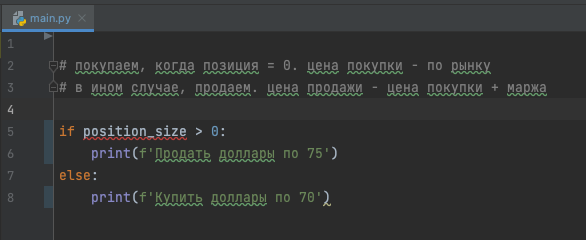
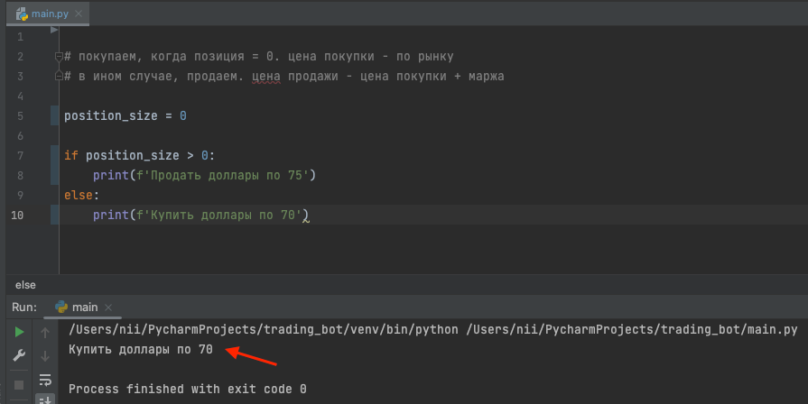
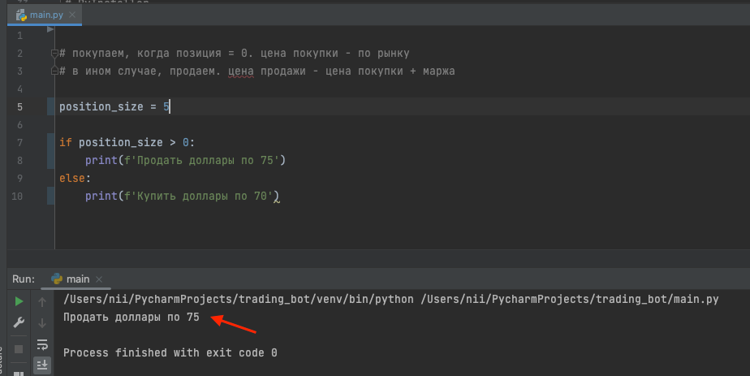
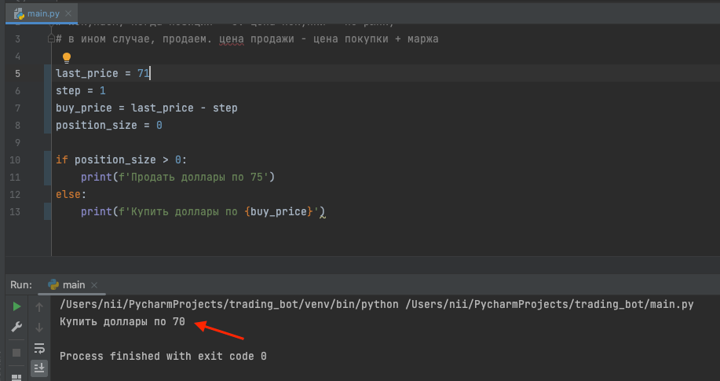
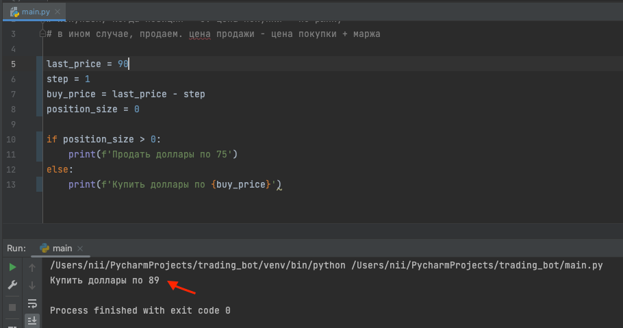

## О чем речь:
Будем писать торгового робота на питоне.
Для начала работа над торговым роботом нужно следующее:

- компьютер, с установленным интерпритатором Python3.
- PyCharm в качестве IDE.

## Текстовая версия
Добрый день.
Сегодня, я буду писать торгового бота на языке питон.
Робот будет работать следующим образом:
- покупать по цене ниже рынка;
- продавать по цене выше цены покупки;

На примере доллара это будет выглядеть примерно так.
Пусть текущая цена доллара - 71 рубль.
Тогда робот будет покупать доллар по 70, а продавать по 75.

Хочу заметить, что продавать робот может только то, что купил ранее, или, говоря биржевым языком, только тогда, когда позиция больше нуля.
Позицию бота, то есть количество долларов в виртуальном кошельке, я буду хранить в переменной position_size.
Тогда логика для покупки и продажи, записанная в виде кода, будет выглядеть так:
    

Если позиция больше нуля, то есть, если у робота есть доллары, он их продает.
В ином случае, то есть когда позиция равна или меньше нуля, робот будет покупать доллар.
Чтобы position_size не подчеркивалась красным, необходимо определить переменную с таким название и задать ей значение. 
Для начала пусть она будет равна нулю. 
Запускаем код, и видим, что робот хочет купить доллары:

Действительно, при отсутствии долларов, бот должен их покупать.
Попробуем изменить значение position_size на, скажем, 5 и запустим код снова.

Действительно, когда у бота есть доллары, он должен их продавать.

Базовый сценарий работы робота определен и даже протестирован. Однако практической пользы от него нет. 
Дело в том, что цены, по которым робот будет покупать и продавать доллары, указаны в абсолютном виде.
Вне зависимости от того, какая цена доллара на бирже, робот будет пытаться купить доллар по 70, а продать по 75.
Если цена ушла вверх и доллар стоит, к примеру, 90 рублей, то купить его за 70 уже не получится.

Цена покупки должна быть чуть ниже цены рынка, то есть чуть меньше цены последней сделки.
Рыночная цена, пусть она будет равна 71 рубль, будет храниться в переменной last_price.
Цена покупки, назовем ее в buy_price, будет равна рыночной цене (last_price) минус какое-то значение.
Это значение может меняться в зависимости от разных факторов. Поэтому его стоит вынести в отдельную переменную.
Назовем ее step и сделаем равной 1.

Теперь, вместо абсолютного значения цены покупки, будем использовать переменную buy_price.
Робот покупает доллары, когда позиция меньше или равна 0. Поэтому поменяем значение position_size на 0 и запустим код.
Видим, что робот хочет купить доллары по 70. 

Представим, что доллар вырос до 90. Изменим last_price, укажем 90.
Запустим код. Робот хочет купить доллары, но уже по 89.

Подобную операцию нужно сделать с ценой продажи. Для этого нам нужно взять цену открытия позиции - position_price
(пока она будет равна buy_price) и прибавить значение желаемой прибыли (маржу из переменной margin).
Теперь можем использовать sell_price вместо абсолютной цены продажи.
Делаем позицию положительную и смотрим цену, по которой робот будет продавать доллары.

Давайте немного протестируем робота. 
Значения переменных last_price, position_size и position_price в будущем, робот будет получать от биржи. 
Сейчас, для тестирования, мы сделаем функции заглушки, которые будут возвращать случайные значения.
Выведем значение переменных и проверим, корректно ли отработал алгоритм.

Алгоритм работает так, как ожидается, но выполняет действие только раз. Нужно, чтобы он работал постоянно.
Добавим бесконечный цикл и задержку между итерациями. Поставим 15 секунд.
Теперь, один раз в 15 секунд, робот будет пытаться купить или продать доллары.

Казалось бы все хорошо. Алгоритм работает правильно. Однако он не учитывает один момент. 
Дело в том, что каждые 15 секунд робот выставляет заявку на покупку или продажу долларов. 
Но выставленная заявка совсем не означает, что доллары будут куплены или проданы.
Вот пример:
Позиция робота равна 1. Цена позиции: 70 рублей. Цена последней сделки 71 рубль.
Робот выставит заявку на продажу 1-го доллара по цене 75 рублей. Но при текущей рыночной цене в 71 рубль, за 75 рублей доллары никто не купит.
Через 15 секунд, робот выставит еще одну заявку на продажу доллара по цене 75 рублей.
Таким образом, через минуту, робот будет продавать уже 4 доллара по цене 75 рублей, а через 5 минут, уже 20.
И это при том, что позиция у робота равна единице.

Чтобы избежать данной ситуации, необходимо проверять наличие открытых заявок у робота. 
То есть, если в предыдущем шаге цикла робот выставил заявку на продажу, но никто не купил доллар, и эта заявка осталась открытой, то на последующих шагах заявку выставлять не нужно.
То же нужно сделать и для покупки.

Воспользуемся функцией-заглушкой и будем записывать результат в переменную open_order.
Переменная open_order может случайным образом принимать значения от 0 до 2.
0 - будет означать, что открытых заявок нет. В этом случае робот будет выставлять заявки. 
Если open_order больше 0, значит открытые заявки есть, и выставление новых не требуется.
Давайте проверим, как это работает.

Всё. Основной алгоритм робота написан и протестирован. 
Немного приведем его в порядок, чтобы не трогать его в дальнейшем и не сломать.
Вынесем задержку в переменную. Сделаем функции для создания заявок. 
Осталось только функции-заглушки заменить на рабочие и можно зарабатывать деньги :)
