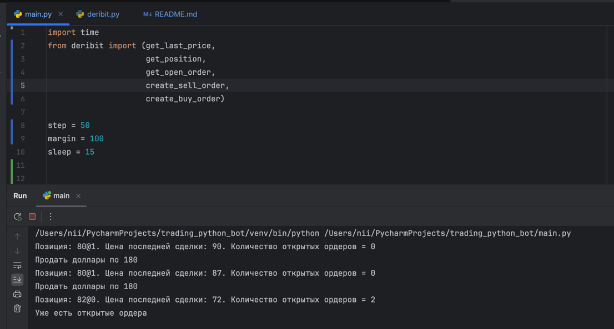
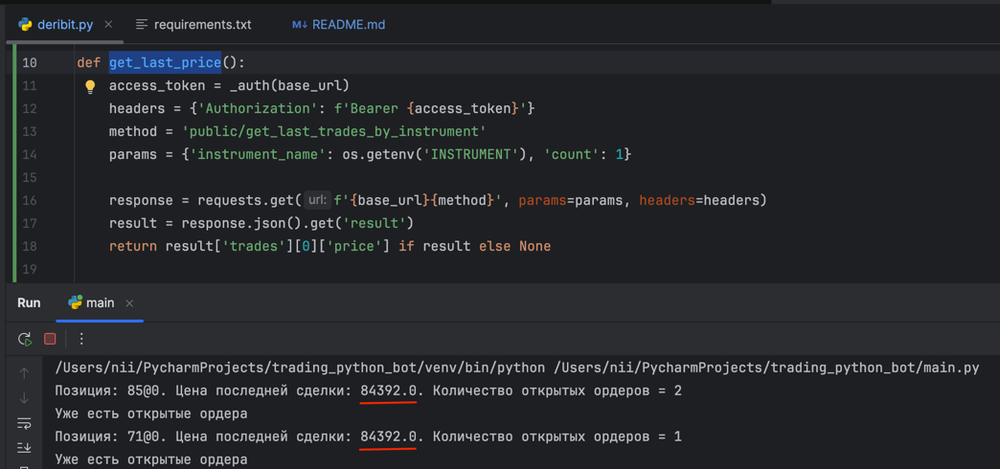
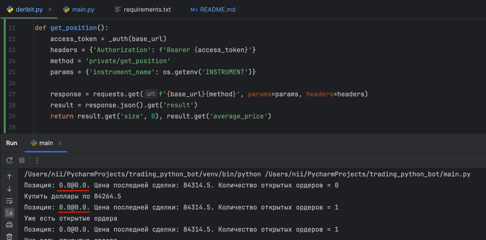
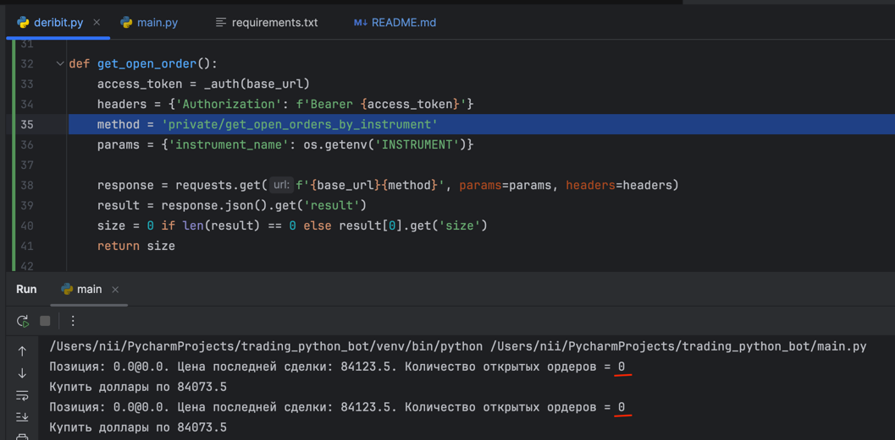
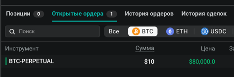
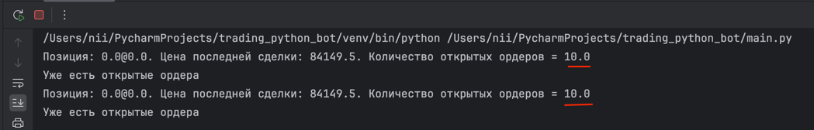
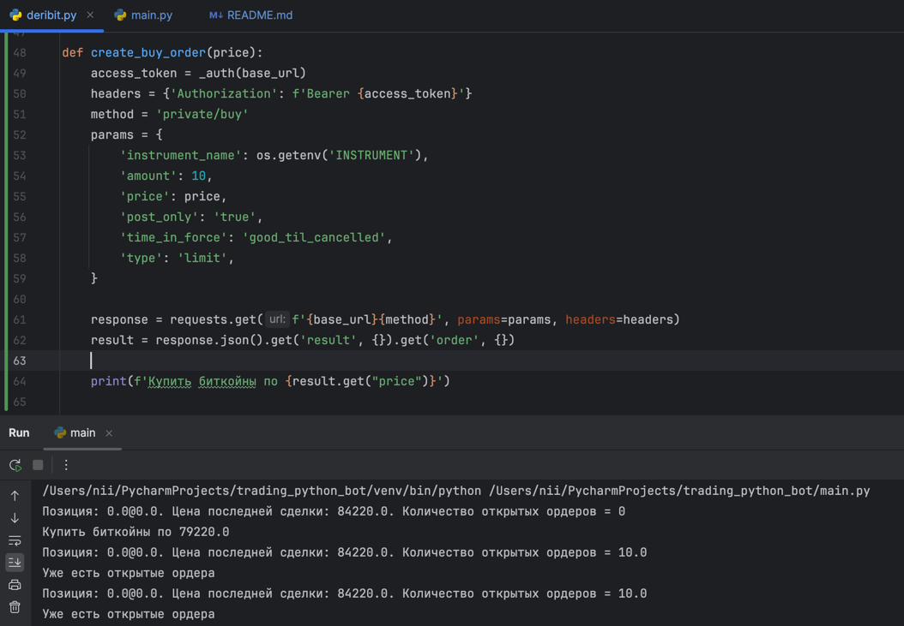
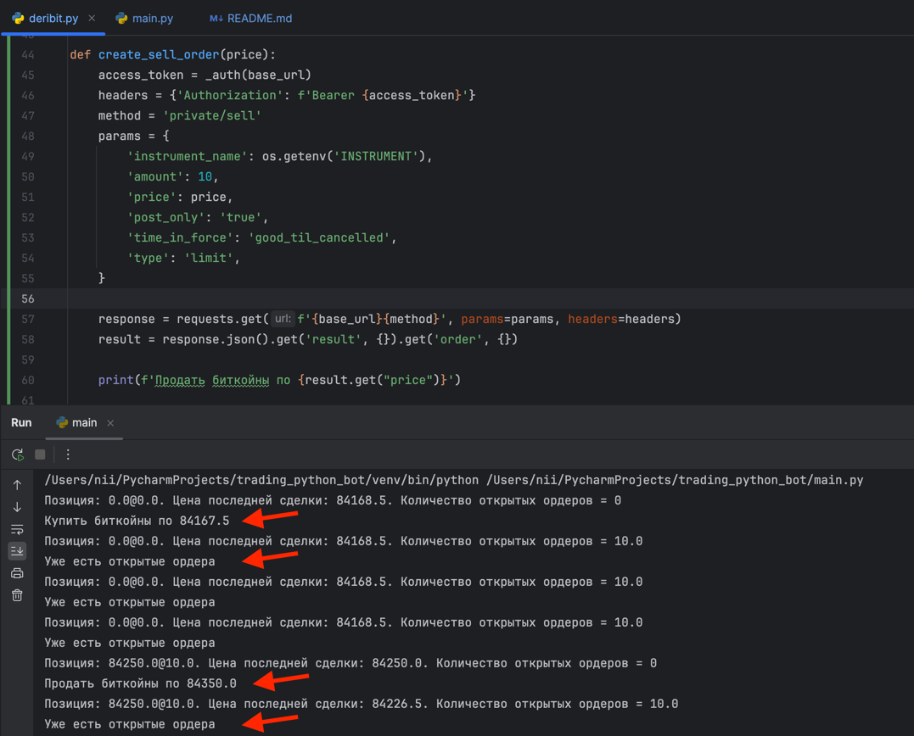

## О чем речь:
Будем писать торгового робота на python.
Для начала работа над торговым роботом нужно следующее:

- компьютер, с установленным интерпретатором Python3.
- PyCharm в качестве IDE.

## part_3 - Текстовая версия
Добрый день.
Продолжаем писать торгового бота на языке python.

В [прошлый раз](https://github.com/c0ch0nnet/trading_python_bot/tree/second_step) и [позапрошлый раз](https://github.com/c0ch0nnet/trading_python_bot/tree/first_step) был реализован и протестирован основной алгоритм бота, а также получен доступ к реальной торговой прощадке - криптовалютной биржи [deribit](https://test.deribit.com/register).
Теперь функции-заглушки нужно заменить на рабочие.

Для начала перенесем функции-заглушки в файл deribit.ru, 
выполним импорт этих функций в main, отредактируем параметра бота
и проверим, что алгоритм по прежнему работает.
Торговать будем инструментом BTC-PERPETUAL. Вынесем его в файл .env.

Алгорим успешно работаем. Перейдем к доработки функций.

Доработаем функцию get_last_price. 

Видим, что цена последней сделки, которая раньше была рандомной, стала реальной. 

Доработаем функцию получения открытой позиции (get_position).

На текущий момент позицию нулевая, о чем сообщает нам лог.

Займемся функцией получения открытых ордеров (get_open_order)

Ожидаемо, количество открытых ордеров равно 0.

Откроем ордер на покупку через интерфейс.

Видим, что функция get_open_order возвращает актуальное количество открытых ордеров.

Осталось самое сложное, функция create_buy_order и create_sell_order.
Начнем с create_buy_order.

После доработки функция выставляет ордер на покупку биткойна.
В последующих шагах выдает сообщение, что открытые орера уже есть и новые ордера на выставляет.

Доработаем create_sell_order и попробуем сделать так, чтобы алгоритм открыл позицию и выставил ордер на продажу.

В логе видем следующее:
1. позиция нулевая, открытых ордеров нет - выставляется ордер на покупку
2. позиция нулевая, есть открытый ордер - выводится сообщение, что есть отурытые ордера
3. позиция не нулевая (купили биткойна), открытых ордеров нет - выставляем ордер на продажу
4. позиция не нулевая, есть открытый ордер на продажу - выводится сообщение, что есть отурытые ордера

Замена функций-заглушек на их рабочий вариант прошла успешно. 
Бот успешно работает и выставляет ордера на реальной торговой площадке.
Оставляем его работать и ждем, когда размер счета увеличится до нескромных размеров :)