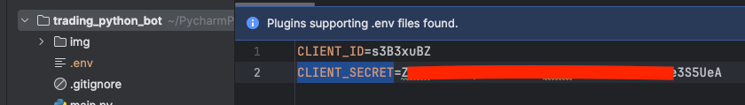

## О чем речь:
Будем писать торгового робота на python.
Для начала работа над торговым роботом нужно следующее:

- компьютер, с установленным интерпретатором Python3.
- PyCharm в качестве IDE.

## part_2 - Текстовая версия
Добрый день.
Продолжаем писать торгового бота на языке python.

В [прошлый раз](https://github.com/c0ch0nnet/trading_bot/tree/first_step) был реализован и протестирован основной алгоритм бота.
Теперь функции-заглушки нужно заменить на рабочие. Для этого необходимо получить доступ к реальной торговой прощадке.
В качестве торговой системы будем использовать биржу deribit.

Для начала нужно создать аккаунт. 
Переходим по ссылку https://test.deribit.com/register. Заполняем "Электронную почту" и "Cтрану проживания". 
Соглашаемся с условиями обслуживания и прочими требованиями. Нажимаем кнопку "Продолжить".

Вводим имя пользователя. Заполняем поля "Пароль" и "Подтвердите пароль". Нажимаем кнопку "Продолжить".

Получаем сообщение об успешной регистрации и просьбе подтвердить электронную почту.

Открываем, указанную при регистрации почту, и ищем письмо от deribit.com с темой "Уведомление о регистрации".
В теле письма находим ссылку, для подтверждения почты.

Переходим по этой ссылки и попадаем на страницу, в правом углу которой, есть кнопка "Войти".

Нажимаем кнопку "Войти". Вводим электронную почту и пароль. Нажимаем кнопку "Продолжить".

Вверху странице, ближе к правому краю экрана, указано количество биткойнов, на счете, имя пользователя, 
а также пиктограмму с человечком. 
Нажатие на пиктограмму открывает допольнительные пункты меню.
В списке этих пунктов нужно найти "API" и перейти в этот раздел для создания ключа.

В открывшемся окне нужно найти кнопку "Добавить новый ключ" и нажаеть на нее.

Выбираем "Ключ, сгенерированный Deribit" и нажимаем кновку 'Далее'

Устанавливаем значение "read_write" для полей "Пакетная сделка", "Аккаунт", "Сделка", "Кошелек" и "Депозитарий".
В поле "Name" указываем имя ключа. Нажимаем кнопку "Создать новый ключ API".

Созданный ключ будет отображаться в таблице "Доступ API" в колонки "Секрет клиента".

Секрет клиента никому и никогда нельзя показывать. Нужно так же следить, чтобы он не попал в git. 
Для этого ключ рекомендуется хранить в специальном файле ".env".
Этот файл, в соответсвии с наcтройками .gitignore, не будет отправляться в git.

Создадим файл ".env" в корне проекта.
Cкопирует содержимое колонки "ID клиента" в перееменную CLIENT_ID.
Скопируем содержимое колонки "Секрет клиента" в CLIENT_SECRET.

На этом работа, необходимая для подключение к реальной торговой прощадке закончена и можно смело браться за замену функций-заглушек на их "боевые" аналоги.
